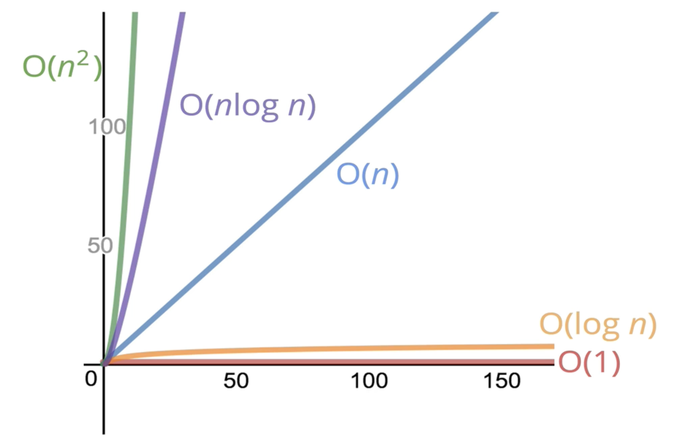

### Big-O Notation의 필요성

{: width: "50%" }

Big-O를 통해 `여러가지 코드를 서로 비교하고 성능을 평가할 수 있다.`

### example

만약, 1 ~ N까지 더하는 함수를 만들어야 한다면

```js
function add(N) {
  let result = 0
  for (let i = 1; i <= N; ++i) {
    result += i
  }

  return result
}
```

```js
function add(N) {
  return N * (N + 1) / 2
}
```

### 무엇이 더 `좋은` 코드일까 ?

- 빠른가 ?
- 메모리를 적게 사용하는가 ?
- 가독성이 좋나 ?

=> 모두 `좋은` 코드의 조건이지만 `속도`에 집중해보자

### 속도는 어떻게 측정할 수 있을까 ?

`performance.now()`를 이용해서 `시간`을 측정해보자.

```js
const t1 = performance.now()

let i = 0
while( i < 100 ) {
  i++
}

const t2 = performance.now()

console.log(t2 - t1)
// 0.014499999999998181
// 0.01366700000000165
```

같은 코드를 실행했는데 다른 결과를 낸다면 객관적으로 지표를 사용할 수 없다.
=> 다른 방식으로 코드를 평가해야 한다

### 그러면 연산의 수를 센다면 ?

=> 현실적으로 연산의 수를 세는 것은 매우 힘들다.

`전체적인 추세` (big picture) 를 보는 것이 중요하다.

즉, 3n => n

### Big-O notation이란 ?

- 대력적으로 숫자를 세는 것의 공식적인 표현

- ⭐️ input size에 따른 runtime 시간과의 대략적인 비율

f(n) = n: linear
f(n) = n^2 quadratic
f(n) = 1 constant

즉, general trend가 중요하다.

O(5n) = O(n)
O(n + 1000000000) = O(n)

### example

```js
function printAtLeast5(n) {
  for (let i = 1; i <= Max(5, n); ++i) {
    console.log(i)
  }
}
```

=> O(n)

```js
function printAtMost(5) {
  for (let i = 1; i <= Min(5, n); ++i) {
    console.log(i)
  }
}
```

=> O(1)

### 공간 복잡도

앞에서는 `시간`에 집중했는데, 이번에는 `공간` 즉, 메모리에 대해 집중해보자.

공간 복잡도란 `알고리즘`이 차지하는 `메모리`이다.

대부분의 원시 타입
- boolean
- number
- null
- undefined

=> O(1)

string, array, object

=> O(N)

string -> string의 길이
array -> array의 길이
object -> object의 key의 개수

### example

```js
function sum(N) {
  let totol = 0
  for (let i = 1; i <= total; ++i) {
    total += i
  }

  return total
}
```

=> O(1)

```js
function double(arr) {
  let result = []
  for (let i = 0; i < arr.length; ++i) {
    result.push(arr[i] * 2)
  }

  return result
}
```

=> O(N)

input의 size에 따라 배열의 길이가 길어지므로 O(N)

